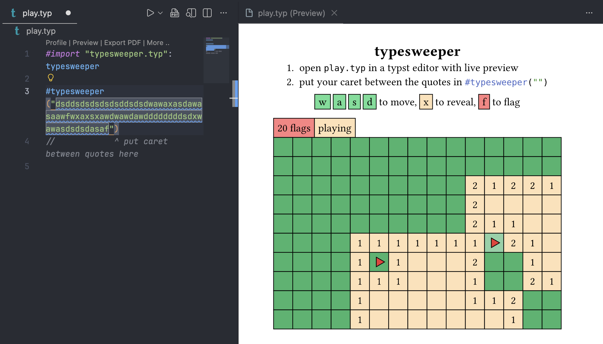

# typesweeper

Implementation of minesweeper in Typst, using Typst's blazingly fast live preview editing as controls.

## prepare

The only files needed to run the game are `play.typ` and `typesweeper.typ`. You can clone the repo if you have Typst installed locally, or copy & paste each file if you're using the [Typst Web App](https://typst.app/).

## play

1. open `play.typ` in a Typst editor with live preview (such as the [Typst Web App](https://typst.app/), or VSCode with the Tinymist extension)
2. pgitut your caret between the quotes in `#typesweeper("")`

`w` `a` `s` `d` to move, `x` to reveal, `f` to flag

### advanced

- specify the size of the map by passing in `size: (rows, cols)`
- change the seed that determines the mine placements by passing in `seed: number`
